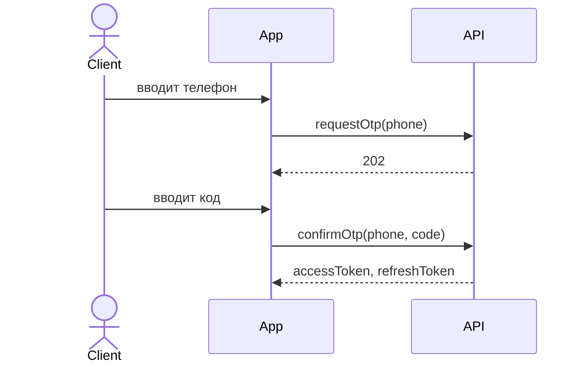
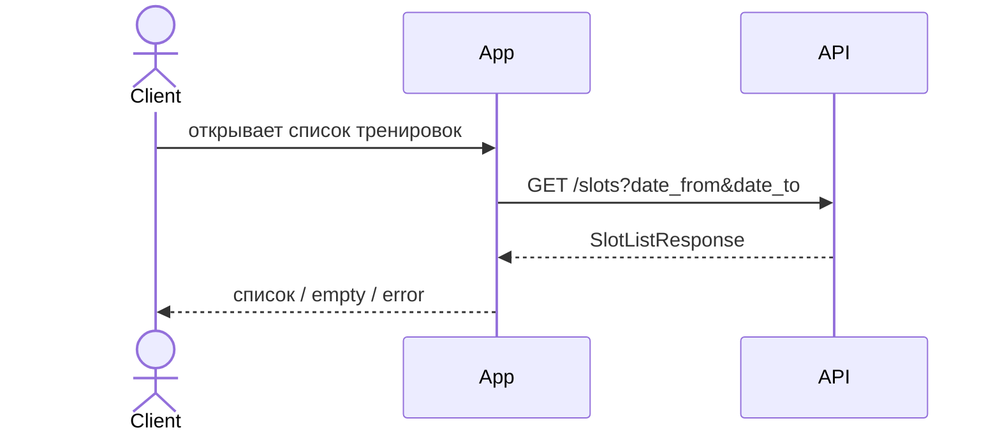
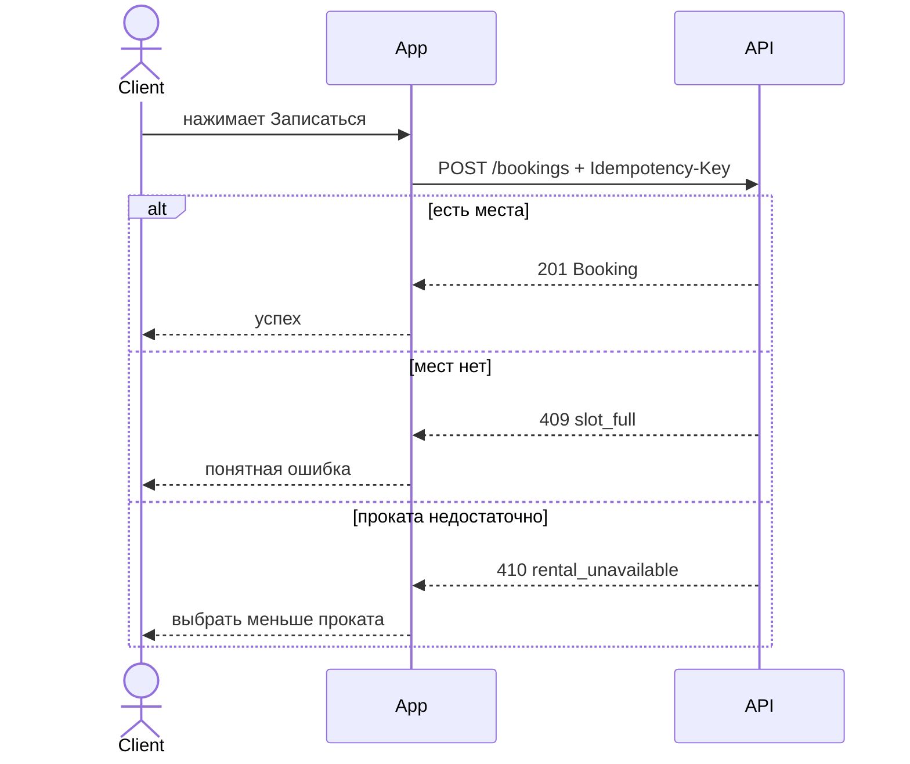
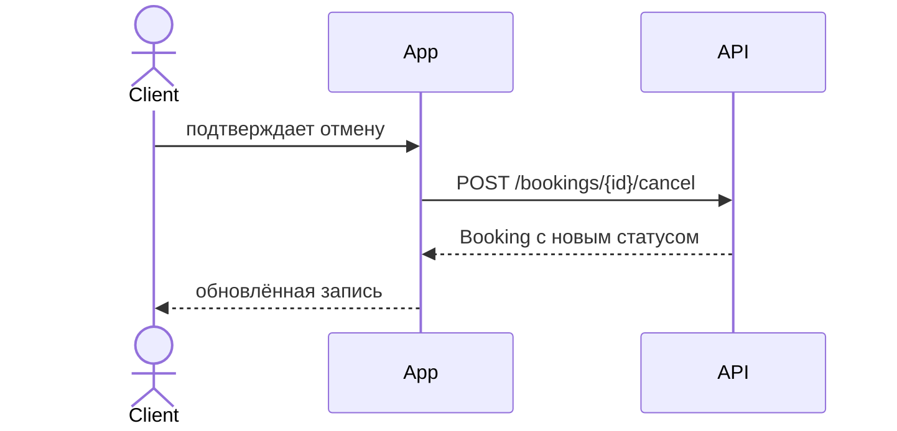
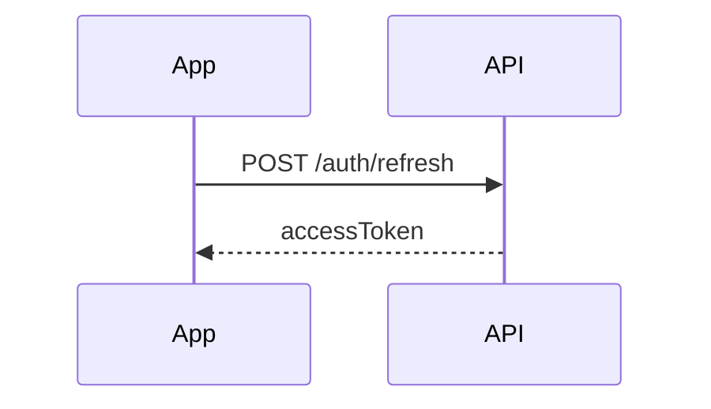

# Sequence-диаграммы API

## OTP-авторизация

```mermaid
sequenceDiagram
    actor Client
    participant App
    participant API
    Client->>App: вводит телефон
    App->>API: requestOtp(phone)
    API-->>App: 202
    Client->>App: вводит код
    App->>API: confirmOtp(phone, code)
    API-->>App: accessToken, refreshToken
```

## listSlots

```mermaid
sequenceDiagram
    actor Client
    participant App
    participant API
    Client->>App: открывает список тренировок
    App->>API: GET /slots?date_from&date_to
    API-->>App: SlotListResponse
    App-->>Client: список / empty / error
```

## createBooking

```mermaid
sequenceDiagram
    actor Client
    participant App
    participant API
    Client->>App: нажимает Записаться
    App->>API: POST /bookings + Idempotency-Key
    alt есть места
      API-->>App: 201 Booking
      App-->>Client: успех
    else мест нет
      API-->>App: 409 slot_full
      App-->>Client: понятная ошибка
    else проката недостаточно
      API-->>App: 410 rental_unavailable
      App-->>Client: выбрать меньше проката
    end
```

## cancelBooking

```mermaid
sequenceDiagram
    actor Client
    participant App
    participant API
    Client->>App: подтверждает отмену
    App->>API: POST /bookings/{id}/cancel
    API-->>App: Booking с новым статусом
    App-->>Client: обновлённая запись
```

## refresh

```mermaid
sequenceDiagram
    participant App
    participant API
    App->>API: POST /auth/refresh
    API-->>App: accessToken
```
