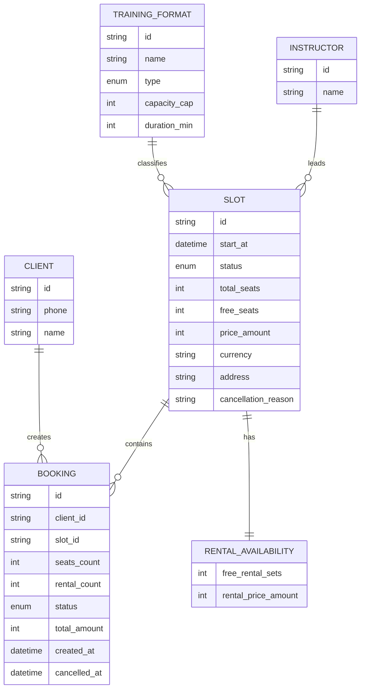

# Технический дизайн — модель данных

## ER-модель

## Mutable/read-only границы

| Сущность | Клиент читает | Клиент меняет |
|---|---:|---:|
| Slot | да | нет |
| TrainingFormat | да | нет |
| Instructor | да | нет |
| RentalAvailability | да | нет |
| Booking | да | создаёт/отменяет свою |
| Client | да | только свои контактные данные, если это поддержано API |

## Инварианты

- `seats_count` в MVP: 1–3.
- `rental_count <= seats_count`.
- `rental_count <= slot.free_rental_sets`.
- Запись разрешена только если `slot.status == scheduled` и есть свободные места.
- Backend решает гонки и двойные брони, клиент обрабатывает отказ.
- Отмена скалодромом не удаляет бронь клиента, а меняет статус на `cancelled_by_club` и добавляет причину.
